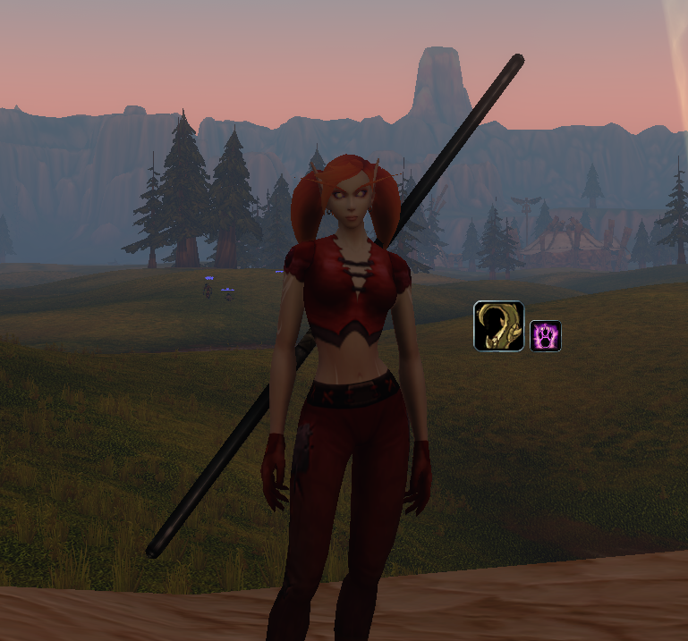
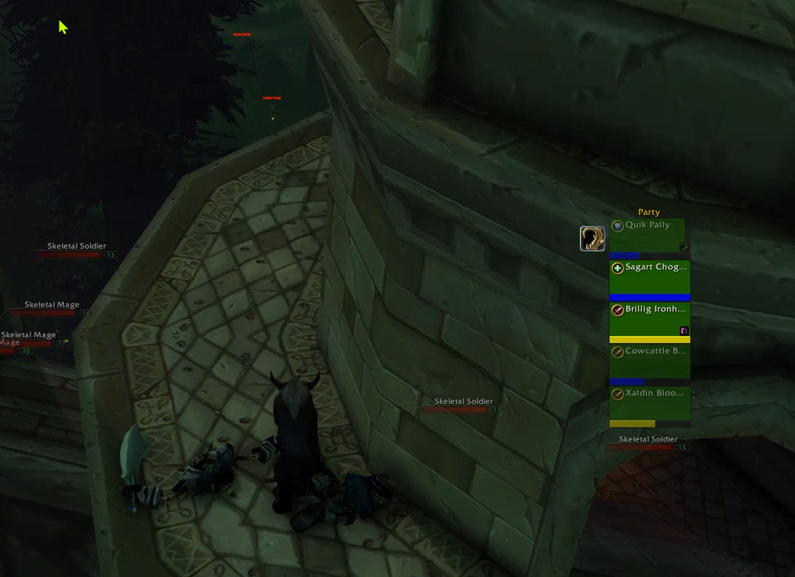

# Opcow's Buff Reminder
A World of Warcraft: Forever addon that displays user placeable icons on your screen when buffs have expired or are soon to expire. Originally written for WoW 1.12 (Vanilla); the 1.12 version is on the `master` branch.

## Combat behavior
WoW: Forever hides aura data from addons during combat, and the list of your buffs can't be read at all. Out of combat Buff Reminder reads every buff and records its expiration time. Each buff group has an **In combat** setting that picks how it's followed during a fight.

**Cooldown Manager** (the default). The buff group is checked once a second and on every aura change, using the best source available:

1. **Direct lookup.** The addon asks about each of the buff group's spells by id. The game still answers for spells it flags as never secret, so these buffs update live in combat: dropped, dispelled, refreshed, and stack counts. Buffs given by name are looked up by the spell id last seen on the aura, or by any rank of your own spell of that name.
2. **Cooldown Manager.** If the spell is secret but it's one of your class buffs tracked on the Cooldown Manager's buff bars or icons, and the Cooldown Manager is turned on, Buff Reminder reads whether that buff is active from the manager's frames. When the manager's remaining time is readable it's used for the countdown, otherwise the old expiration time is kept. The manager follows only one rank of some buffs, ex: Mark of the Wild rank 2 while you have rank 3, and then the buff group is predicted. The Buff groups tab says when that happens; use Blizzard Auras for those.
3. **Prediction.** Otherwise the buff group keeps the state it had when combat started. Its own timer runs from the expiration time recorded before the pull, so early warnings and expiry still show on time. Buffs lost or refreshed early aren't seen until combat ends.

If a buff group can only be predicted, because the Cooldown Manager isn't available for your class, is turned off, or doesn't track the buff, Buff Reminder says so in chat after you log in and on the Buff groups tab.

**Blizzard Auras**, for buffs the Cooldown Manager can't track, like a shaman's Lightning Shield. Blizzard's own aura button is placed over the buff group's icon and shows the buff with its exact time and stack count for the whole fight, with the count in red at or under the buff group's low stack warning. When the buff drops the button disappears and the reminder icon underneath shows. Addon code can't read what Blizzard's button shows, so in combat the buff group's icon is always shown, not only when the buff is missing or low. Use the buff group's conditions to limit when that is. The button is set up out of combat and needs the buff's spell id, which is known once you've had the buff or when you add it by id.

**Casting a buff in combat.** When you cast one of a buff group's buffs on yourself during a fight, the buff group is marked as up right away and its timer starts from the cast, using the buff's duration from the last time it was read out of combat. This works in either mode and doesn't need the aura to be readable. A buff that has never been read out of combat on this character has no known duration and waits for the sources above. A cast aimed at another player doesn't count. `/obr debug` prints what each cast of a buff group's buff decides, for when one isn't picked up.

**Charges used by hits.** Some buffs lose a charge when you're hit, like Lightning Shield, Water Shield and Inner Fire, and neither the buff nor its charges can be read in combat. The hits you take can be, so a Cooldown Manager buff group can count its charges down from the pull. Set **Charges used by** (Buff groups tab, under In combat) to **Hits** for any hit, or **Physical hits** for melee and ranged hits only, like Inner Fire. **Cooldown** is how soon after a charge is used another hit can use one: 3 seconds for Lightning Shield, 0 for Inner Fire, where every hit counts. Dodges, parries and misses don't count, nor do hits a shield fully absorbs, like Power Word: Shield. At 0 the icon shows the buff as gone, and **Warn at stacks** warns before that, ex: 1. Casting the buff again in combat starts over with the most charges it's been seen with. A hit the game reports oddly can throw the count off by one until combat ends.

When combat ends everything is read again, which corrects any prediction.

## Low stack warning
A buff group can warn when its buff is down to a number of stacks or charges, ex: Inner Fire at 3 (Buff groups tab). The icon shows with the count in the lower right corner and the time left at the top. The time left text, the cooldown swipe and the stack count can each be turned off, and when an icon has both texts you can pick which one shows (Options tab). Each buff group can override how it shows the time left: text, swipe, both or none (Buff groups tab). In combat the count only updates when the buff can be read live (source 1 or 2 above, when the manager exposes the aura), or on Blizzard's button in Blizzard Auras buff groups. Otherwise it's refreshed after combat.

## Click to cast
Click a buff group's icon to cast its spell on yourself. **Click to cast** on the Options tab turns it on or off and sets which click does it: click the button beside it, then click it again with the mouse button you want, holding Shift, Ctrl or Alt if you like, ex: Shift-Right click. A click with a key held leaves a plain click free, so an icon can't be cast by accident. **Click to cast** on the Buff groups tab picks the spell: **Auto** uses the first of your own spells in the buff group, or pick one of them, or turn it **Off**. Buff groups with none of your spells, like food, can't be clicked. Weapon enchant icons put on what you last used on that hand, see Weapon enchants.
The game doesn't let addons move or hide clickable buttons during combat, while Buff Reminder's icons come and go all fight. So icons can only be clicked out of combat; when a fight starts they stop taking clicks and they're clickable again once it ends. Unlocked icons can't be clicked either, so they can be dragged. An icon with its opacity set to 0 isn't clickable.

## Click to dismiss
Right click an icon to hide it until the buff is put on again, ex: a buff you can't get right now. It works on your own icons, weapon enchants and party members' icons, in combat too. **Click to dismiss** on the Options tab turns it off or changes the click, the same way as Click to cast; the two can't use the same click. While it's on, icons take mouse clicks even when they can't be cast, so a click on one doesn't reach the game world behind it. Dismissed icons come back after a reload, and show as usual while the icons are unlocked.

## Party reminders
When you give a party member a buff from one of your buff groups, ex: Thorns, Buff Reminder remembers it for them. When that buff is gone from them, a panel shows their name on a bar in their class color, with their role icon if they have one, and the buff's icon, one line per party member. It counts whoever cast the buff, and a buff group counts as one buff, so Gift of the Wild covers Mark of the Wild. Nothing is set up ahead of time: a member you've never buffed never gets a line.

- Right click an icon (the dismiss click, see Click to dismiss) to forget that buff for them until you're seen buffing them with it again.
- Click an icon to cast the buff on them, the same way as your own icons.
- **Early warning** (Options tab) also shows a buff before it runs out, using the buff group's early warning time.
- Uncheck **Party** on a buff group (Buff groups tab) for buffs you only keep on yourself.
- The button beside **Early warning** picks where the icons go. **By party frames**, the default, picks a side from where your party's frames are: beside them when they're stacked, above or below when they're side by side, whichever is toward the middle of the screen. Or pick right, left, above or below each member's party frame yourself, or the panel. This works with Blizzard's standard and raid-style party frames, and the icons follow the frames when you move them. Members whose frame isn't showing still go on the panel. Frames from other addons aren't followed.

The panel hides in combat, since party buffs can't be read then. Members who are dead, offline or out of sight are skipped. Unlock the icons and the panel shows four made up members, Party 1 to Party 4, with icons from your buff groups, so you can see where it is and how it looks. Drag it by the handle above it. Everything is forgotten when a member leaves the party or you do, and nothing is saved between sessions. Pets aren't included.

## Weapon enchants
Temporary weapon enchants, like poisons, oils, sharpening stones and shaman imbues, have two built-in weapon enchant groups at the top of the Buff groups list: **Main hand enchant** and **Off hand enchant**. They start turned off; set **Show** to Normal to use one. Each hand has its own conditions, early warning time, low charges warning, script, time left and icon size, the same as a buff group. They can't be deleted and have no In combat setting, since weapon enchants can always be read.

Clicking a weapon enchant icon puts what you last put on that hand on it again: the same poison, oil or sharpening stone from your bags, or the same imbue spell. It's remembered when you put one on out of combat, and the Buff groups tab shows it beside **Click to apply**, where it can be turned off. The icon can't be clicked until something has been remembered, or when none of that item is left in your bags. Out of combat, the icon's corner shows how many of that item are in your bags, like an action button, in red at 0, or a "?" while nothing has been remembered. Check **Count** beside Click to apply to show the count all the time, in combat too. Hovering an icon that can't be clicked shows what was last used and why.

## Placing icons
Icons snap together on a grid, into rows, columns, squares or any other shape. At first every icon is in one row. Unlock the icons (the Options tab or Shift-click the minimap button) and every icon shows, grey when it isn't needed right now:
- Drag an icon to move it together with the icons snapped to it.
- Shift-drag an icon to pull it away on its own, like taking a button off an action bar.
- Drop icons touching others, above, below or beside them, and they snap on. Dropped into a row or column they push the rest along.

A straight row or column closes up and centers the icons it's showing, like the 1.x row did. Any other shape keeps its gaps, so each icon keeps its spot.

Each buff group can have its own icon size (Buff groups tab). Every row is as tall and every column as wide as its biggest icon. A smaller icon lines up with the top, middle or bottom of its row, or the left, center or right of its column, whichever is nearest where you drop it. Dropping a big icon beside smaller ones lines them up the same way. "Icons in one row" on the Options tab puts every icon back in one row. Lock the icons again when you're done.

## Options window
Everything is set up here. Open it with `/obr`, the minimap button or the addon compartment (the addons button by the minimap). Drag the minimap button to move it around the minimap, the Options tab hides it. Clicking either button:
- Left-click opens the options window.
- Right-click temporarily hides or shows the icons.
- Shift-click unlocks or locks the icons for moving.

The **Buff groups** tab manages buff groups and the weapon enchant groups, their buffs, conditions, early warning time, low stack warning, script, how the time left shows, how a missing buff or a warning is marked, opacity, icon size, the spell a click casts and how they're followed in combat, with a line saying how well that works for the buff group. "Browse..." picks a buff from a searchable list with three tabs:
- **My spells**: spells in your spellbook that look like buffs, going by their description. "Show all spells" lists every spell if one is missed.
- **Active now**: the buffs you have right now.
- **Seen before**: buffs you've had on this character, including food, elixirs and buffs other players cast on you. The last 200 are kept.

Buffs already in a buff group are greyed out with the buff group's name.

The **Options** tab has the defaults new buff groups start with, the default icon size, the opacity of icons whose buff is missing and of ones warning it's running out or low on stacks (buff groups can have their own), how icons whose buff is missing or running out are marked, the warning sound and a reset button. "Browse..." beside the warning sound lists the game's sounds, click one to use it and hear it.

"Save / load..." on the Options tab shares settings (buff groups, weapon enchants, options and icon placement) between characters:
- Type a name at the top and click Save to keep a copy of this character's settings under that name. Saves belong to the account, so every character can load them. Saving under a name already in use replaces that save, after asking.
- Under **Saved**, click a save to load it in place of this character's settings. The X deletes it.
- Under **Characters**, click a character to copy its settings instead. A character is listed once it has logged in with Buff Reminder, with the settings it had when it last logged out. The X forgets it.

A missing buff can be marked with a glow (pulse, flash, steady, or the game's spell alert glow like a proc on an action button) and a color washed over the icon, ex: red. Icons warning that a buff is running out or low on stacks have their own glow and color, ex: a pulse to catch your eye before the buff drops. Each buff group picks its own or follows the Options tab, and both start with none. A small icon at the end of each row previews the look, with the glow, color and opacity together.

Text fields save when you press Enter, Escape undoes the edit. Text shows yellow until it's saved.

Condition checkboxes cycle through three states: off, hide the icon while true, and hide the icon while false (red check).

#### Notes
- Buffs you want to monitor must be added to buff groups.
- Mutually exclusive buffs should go into common buff groups.
- A buff that's one of your own spells isn't shown while the spell is on cooldown, ex: Berserking, since it can't be cast yet. When the game hides the cooldown in combat it's predicted from when you cast the buff. A buff group that also has a buff you don't cast, like food, always shows.
- Buffs can be given by name (any rank matches) or spell id.
- Conditions are tri-state: ignored, hide the icon while true, or hide the icon while false.
- A buff group's script hides the icon while it returns true. Example: `return UnitPower("player") < 2000`
